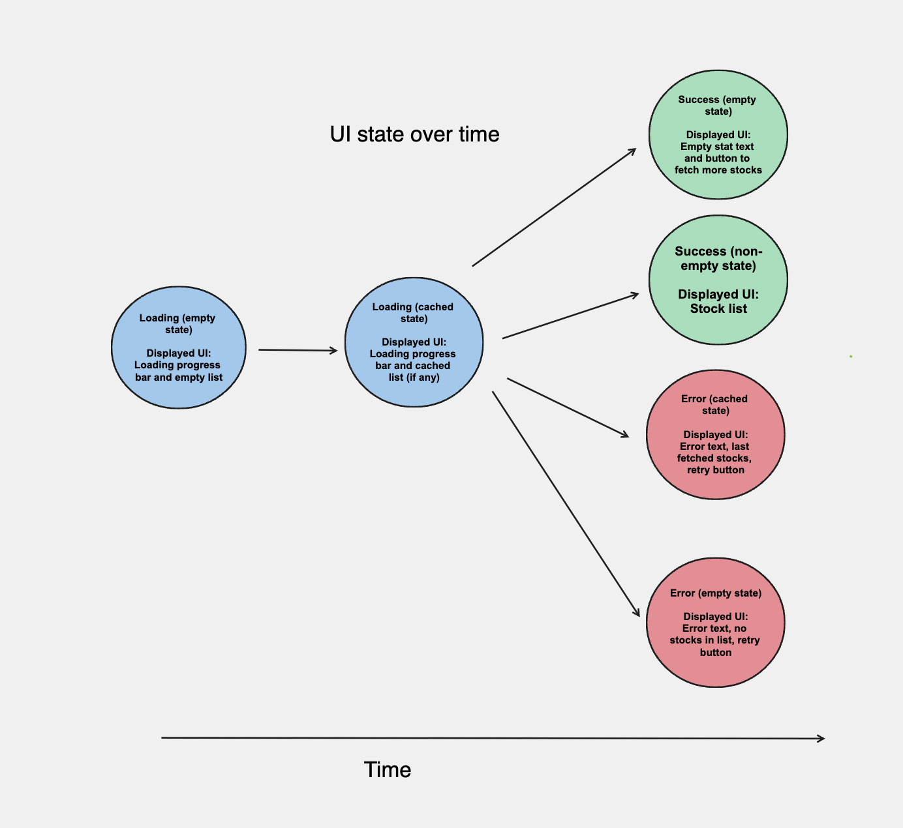

Hi! Welcome to my Stock app. This readme outlines architectural approaches I took and why,
along with UI choices and reasonings, directions on how to run the project,
and 3rd party libraries used. 

The architectural approach you took and why

This product used MVVM with clean architecture. I've found this is the
easiest way to extend the project as the functionality of the app increases, and also 
provides a clean way to separate the business logic within different classes.

See the linked resource for how data flows through the app

The UI updates over time as depicted in 

UI decisions made:
- Align price, and company details for all rows. Display quantity if available.
- Split up data by watchlist and stocks. If the user has no quantity, we can add that
to a watchlist section. Otherwise it'll displayed in a stock section of the list.
- Currency info is denoted by currency symbol at the front of price (i.e. USD -> $)
- Add emojis to make the app more delightful

Things to note:
Loading state progress bar will be displayed until a success or error response from the api

Empty state button in success response assumes that tapping that button 
is hooked up to an api that can give them stocks and/or a watchlist

The trade offs you made and why

Add caching/db layer makes things more complex and assumes a user might want invalid/out of date data if
we can't fetch the most up to date data. I made that since I thought that'd a better experience than no data.

Split up watchlist and stocks since I thought that made the app more visually appealing and followed
patterns of other stock apps.

How to run your project
The recommended way to run the project is to:
Sync gradle dependencies
Tap the "Run app" play button in Android Studios to launch the app

To see all the UI states, I'd recommend running the following states in this order:

Success state empty:
1. Uninstalling the app if installed
2. Change the getStocks() path in StockApi.kt to "portfolio_empty.json"
3. Clean project and run the app

Expected view: 

Error state empty:
1. Change the getStocks() path in StockApi.kt to "portfolio_empty.json"
2. Clean project and run the app

Expected view: 

Success state with stocks:
1. Change the getStocks() path in StockApi.kt to "portfolio.json"
2. Clean project and run the app

Expected view: 

Error state with stocks:
1. Change the getStocks() path in StockApi.kt to "portfolio_error.json"
2. Clean project and run the app

Expected view: 

3rd party libraries or copied code you may have used Any other information that you would like us to know

- This project used xml (not compose) since I was the most familiar with that. I used
autogenerated databinding classes instead of findViewById to ensure type safety
- This project used Room for the local database to cache responses.
- A collection of testing libraries to enable testing, specifically with flows and coroutines.
- This project used Retrofit to handle parsing and object creation of network api responses.
- This project used Dagger hilt for DI

NOTE:
If you have issues building the app, please clean and rebuild. There seems to be an issue
with one of the 3rd party libs that I wasn't able to track down in time. 